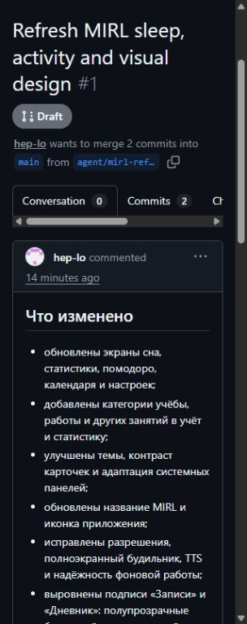
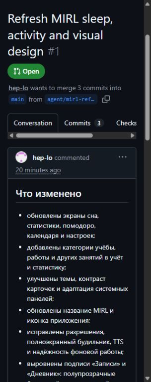
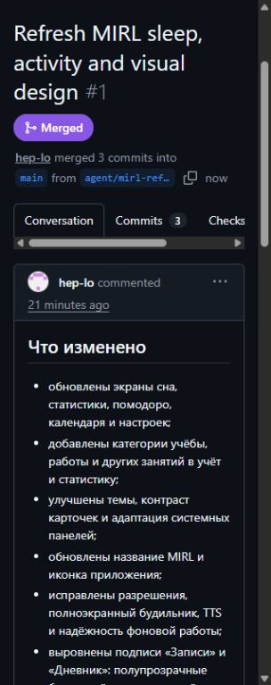
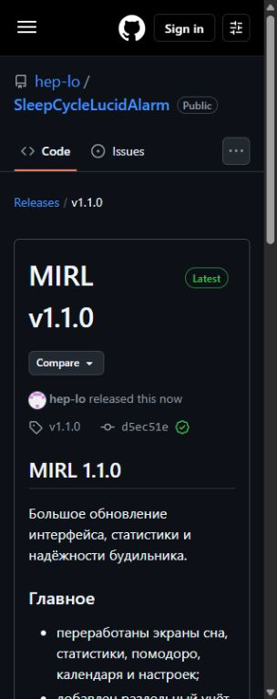

# Как выпускать новую версию MIRL

Ниже описан полный безопасный процесс: изменение версии, проверка проекта, Pull Request, слияние в `main` и публикация APK в GitHub Releases.

## 1. Повысить версию приложения

Откройте `app/build.gradle.kts` и измените два значения:

```kotlin
defaultConfig {
    versionCode = 2
    versionName = "1.1.0"
}
```

- `versionCode` — целое число, которое обязательно увеличивается при каждом выпуске: `1`, `2`, `3` и так далее.
- `versionName` — видимый номер версии: `1.0.0`, `1.1.0`, `1.1.1` и так далее.
- тег GitHub обычно повторяет `versionName`, но с буквой `v`: например, `v1.1.0`.

Нельзя выпускать новый APK со старым `versionCode`: Android может не принять его как обновление.

## 2. Проверить и собрать релиз

В PowerShell из корня проекта выполните:

```powershell
$env:GRADLE_USER_HOME="$env:USERPROFILE\.gradle"
.\gradlew.bat testDebugUnitTest lintDebug assembleRelease
```

Успешный результат заканчивается строкой `BUILD SUCCESSFUL`.

APK появятся здесь:

- `app/build/outputs/apk/release/app-arm64-v8a-release.apk` — современные 64-битные устройства;
- `app/build/outputs/apk/release/app-armeabi-v7a-release.apk` — старые 32-битные устройства.

## 3. Создать ветку и Pull Request

Команды:

```powershell
git switch -c agent/mirl-1.2.0
git add app/build.gradle.kts
git commit -m "Release MIRL 1.2.0"
git push -u origin agent/mirl-1.2.0
gh pr create --draft --base main --fill
```

На странице Pull Request сначала будет серая метка `Draft`.



Проверьте вкладки:

- **Commits** — только ожидаемые коммиты;
- **Files changed** — нет случайных файлов, ключей и локальных настроек;
- **Checks** — автоматические проверки завершились успешно, если они настроены.

## 4. Перевести PR в готовый

На странице PR нажмите **Ready for review**. Через командную строку то же самое делает:

```powershell
gh pr ready <номер-PR>
```

Метка `Draft` сменится на зелёную `Open`.



## 5. Слить изменения в main

На странице PR нажмите:

1. **Merge pull request**;
2. **Confirm merge**.

Или выполните:

```powershell
gh pr merge <номер-PR> --merge
```

После успешного слияния появится фиолетовая метка `Merged`.



Перед созданием релиза убедитесь, что версия попала в `main`:

```powershell
git fetch origin main
git show origin/main:app/build.gradle.kts | Select-String "versionCode|versionName"
```

## 6. Опубликовать GitHub Release через сайт

1. Откройте вкладку **Releases** репозитория.
2. Нажмите **Draft a new release**.
3. В **Choose a tag** введите новый тег, например `v1.2.0`, и выберите создание нового тега.
4. В качестве цели выберите `main`.
5. Укажите заголовок `MIRL v1.2.0`.
6. Заполните список изменений.
7. Перетащите оба APK в область **Attach binaries by dropping them here or selecting them**.
8. Нажмите **Publish release**.

Никогда не используйте повторно старый тег для другого APK. Для исправленного выпуска создайте следующий номер, например `v1.2.1`.

## 7. Опубликовать GitHub Release через команду

```powershell
gh release create v1.2.0 `
  "app\build\outputs\apk\release\app-arm64-v8a-release.apk#MIRL 1.2.0 — arm64-v8a" `
  "app\build\outputs\apk\release\app-armeabi-v7a-release.apk#MIRL 1.2.0 — armeabi-v7a" `
  --target main `
  --title "MIRL v1.2.0" `
  --generate-notes `
  --latest
```

Итоговая страница должна показывать правильный тег, метку `Latest` и приложенные APK.



## 8. Финальная проверка

Проверьте:

- тег релиза совпадает с `versionName`;
- релиз создан от актуального `main`;
- в разделе **Assets** присутствуют нужные APK;
- APK скачиваются, а размер файлов не равен нулю;
- секреты, `local.properties`, ключи подписи и пароли не попали в коммиты;
- старые релизы не удалены — они нужны пользователям для отката.

Посмотреть опубликованные релизы можно на странице:

`https://github.com/hep-lo/SleepCycleLucidAlarm/releases`
